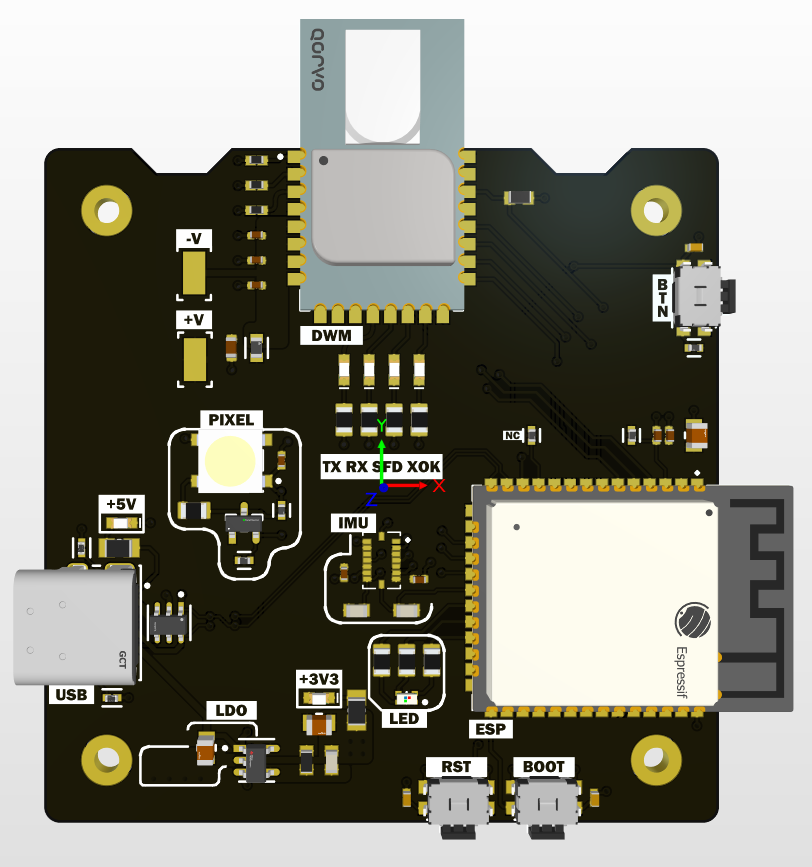
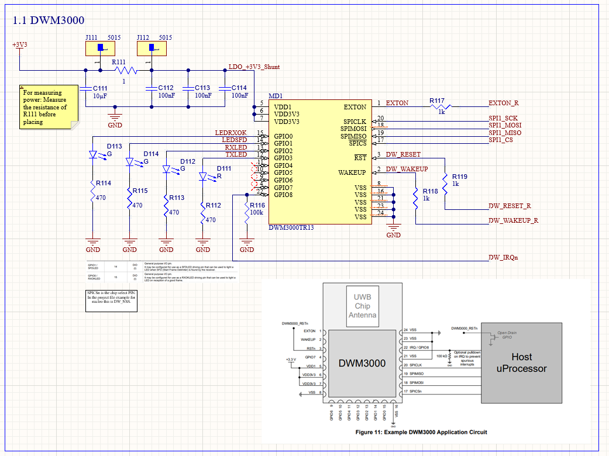
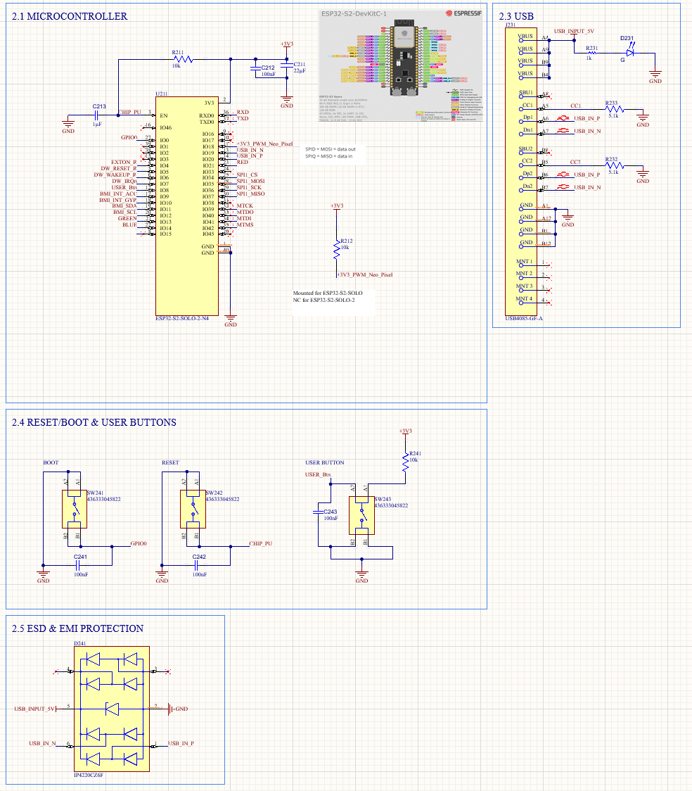
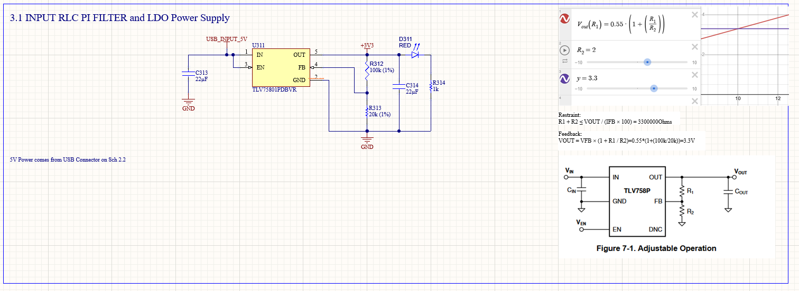
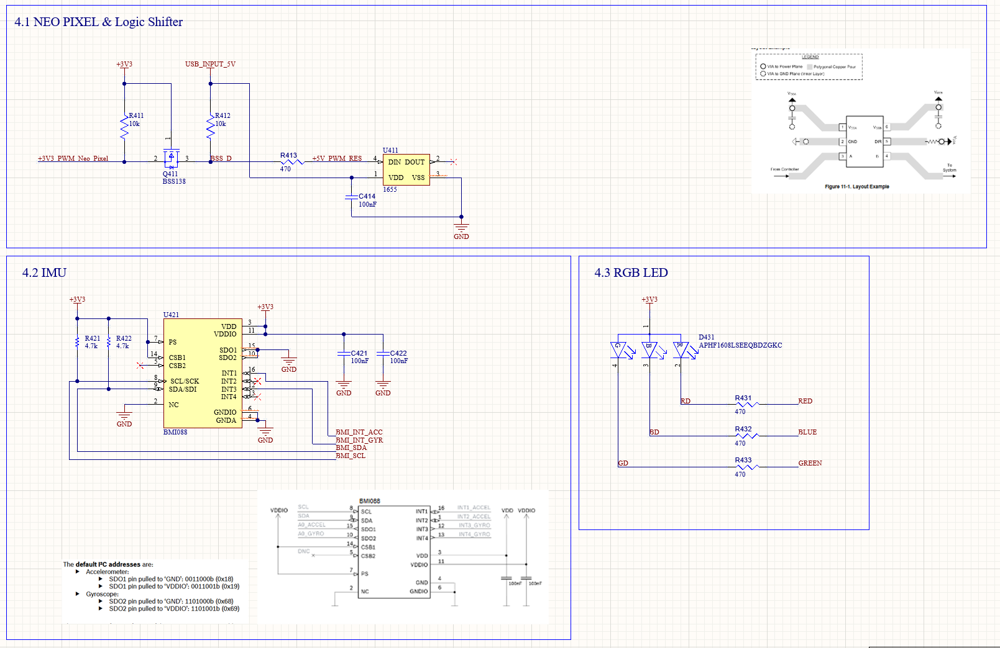

# UWB-Wireless-Board
Board with wireless and UWB capabilities

## UWB-Wireless-Board Front View

## Schematics
### Schematic DWM

### Schematic ESP

### Schematic Power

### Accessories

## Finished Image of Previous Revision

## Curent Revision
PCB shipment coming soon ordered from JLC PCB

